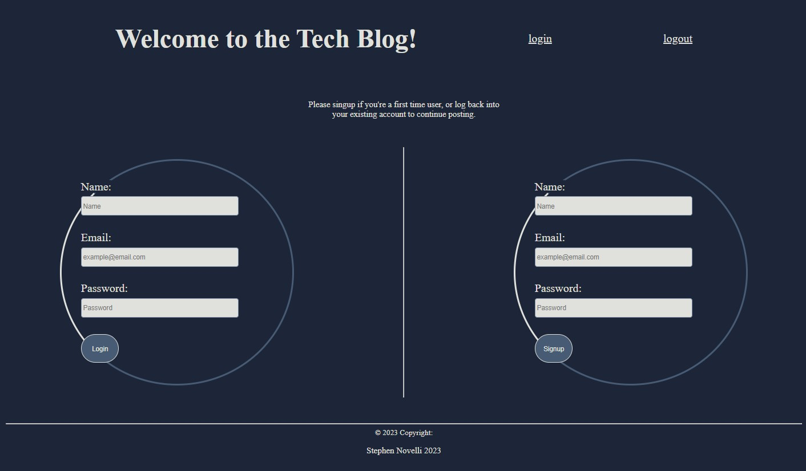

# Tech Blog 
  
  # Table of Contents

- [Tech Blog ](#tech-blog-)
- [Table of Contents](#table-of-contents)
  - [Description:](#description)
  - [Installation:](#installation)
  - [Usage:](#usage)
  - [License:](#license)
  - [Contribution:](#contribution)
  - [Tests:](#tests)
  - [Preview:](#preview)
  - [Accreditations:](#accreditations)

   
## Description:
The Tech Blog application allows a user to create and delete blog posts and comments as long as they are signed in. The first time a user visits the Tech Blog they will need to create an account before they can sign in and begin to use the application.  
    
## Installation:
You can find the Tech Blog available online and ready to use. Just click [here](https://polar-eyrie-56885.herokuapp.com/) and create your account today!
    
## Usage:
Visit [Tech Blog](https://polar-eyrie-56885.herokuapp.com/) and you will be presented with the login and signup page. If you are a first time visitor and need to signup, enter the credentials you would like to use for your account and click on sign up. Once you are signed up you will be logged in and taken to the Homepage where you can existing blog posts from all users. Switch over to the Dashboard view to begin creating blog posts and comments of your own!

## License:
Copyright 2022, Team 7

Permission is hereby granted, free of charge, to any person obtaining a copy of this software and associated documentation files (the "Software"), to deal in the Software without restriction, including without limitation the rights to use, copy, modify, merge, publish, distribute, sublicense, and/or sell copies of the Software, and to permit persons to whom the Software is furnished to do so, subject to the following conditions:

The above copyright notice and this permission notice shall be included in all copies or substantial portions of the Software.

THE SOFTWARE IS PROVIDED "AS IS", WITHOUT WARRANTY OF ANY KIND, EXPRESS OR IMPLIED, INCLUDING BUT NOT LIMITED TO THE WARRANTIES OF MERCHANTABILITY, FITNESS FOR A PARTICULAR PURPOSE AND NONINFRINGEMENT. IN NO EVENT SHALL THE AUTHORS OR COPYRIGHT HOLDERS BE LIABLE FOR ANY CLAIM, DAMAGES OR OTHER LIABILITY, WHETHER IN AN ACTION OF CONTRACT, TORT OR OTHERWISE, ARISING FROM, OUT OF OR IN CONNECTION WITH THE SOFTWARE OR THE USE OR OTHER DEALINGS IN THE SOFTWARE.

[View License](https://www.mit.edu/~amini/LICENSE.md) 
    
## Contribution:
Stephen Novelli
    
## Tests:
No tests are required.
    
## Preview:

## Accreditations:
  Tech Blog utilizes Handlebars.js as the primary templating language to change the application's page view. Express.js is used to build the server along with Node.js as the application framework. User's Posts, and Comments are stored in a SQL Database on the backend. The Tech Blog application is deployed for use publicly via Heroku.